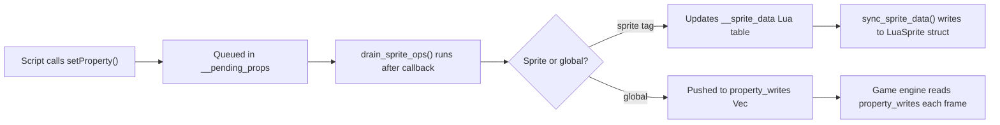

The property system is the primary bridge between Lua scripts and Rust game state. Use `setProperty` and `getProperty` to read and write properties on sprites, characters, cameras, and gameplay globals. Use `setVar` / `getVar` for custom variables shared across scripts.

---

## `setProperty`

Sets a property on a game object, sprite, or gameplay global.

<ParamField path="name" type="string" required>
  The property path. The format determines what is targeted:
  - **`"tag.field"`** — A field on a Lua sprite (e.g. `"mySprite.alpha"`).
  - **`"characterName.field"`** — A character position (e.g. `"dad.x"`, `"boyfriend.y"`).
  - **`"globalName"`** — A gameplay global (e.g. `"defaultCamZoom"`, `"cameraSpeed"`).
</ParamField>

<ParamField path="value" type="number | boolean | string" required>
  The value to set.
</ParamField>

```lua
-- Sprite fields
setProperty("mySprite.alpha", 0.5)
setProperty("mySprite.visible", false)
setProperty("mySprite.x", 400)
setProperty("mySprite.angle", 45)
setProperty("mySprite.scale.x", 2.0)
setProperty("mySprite.flipX", true)

-- Character positions
setProperty("dad.x", 200)
setProperty("boyfriend.y", 300)

-- Gameplay globals
setProperty("defaultCamZoom", 1.1)
setProperty("cameraSpeed", 0.5)

-- Custom variables (stored in __custom_vars, readable by getProperty)
setProperty("myCounter", 0)
```

### Supported sprite fields

| Property path | Type | Description |
|---|---|---|
| `tag.x` | number | X position |
| `tag.y` | number | Y position |
| `tag.alpha` | number | Transparency (0–1) |
| `tag.visible` | boolean | Visibility |
| `tag.angle` | number | Rotation in degrees |
| `tag.scale.x` / `tag.scaleX` | number | Horizontal scale |
| `tag.scale.y` / `tag.scaleY` | number | Vertical scale |
| `tag.flipX` / `tag.flip_x` | boolean | Horizontal flip |
| `tag.flipY` / `tag.flip_y` | boolean | Vertical flip |
| `tag.antialiasing` | boolean | Smooth rendering |
| `tag.scrollFactor.x` | number | Horizontal parallax factor |
| `tag.scrollFactor.y` | number | Vertical parallax factor |
| `tag.origin.x` | number | Rotation origin X |
| `tag.origin.y` | number | Rotation origin Y |
| `tag.offset.x` | number | Render offset X |
| `tag.offset.y` | number | Render offset Y |
| `tag.colorTransform.redOffset` | number | Red channel offset (−255–255) |
| `tag.colorTransform.greenOffset` | number | Green channel offset |
| `tag.colorTransform.blueOffset` | number | Blue channel offset |

### Supported gameplay globals

| Property | Type | Description |
|---|---|---|
| `defaultCamZoom` | number | Resting camera zoom |
| `cameraSpeed` | number | Camera follow speed multiplier |
| `camZooming` | number | Whether beat zoom is active |
| `health` | number | Current health (0–2) |
| `crochet` | number | Milliseconds per beat |
| `stepCrochet` | number | Milliseconds per step |
| `isCameraOnForcedPos` | boolean | Lock camera to forced position |

---

## `getProperty`

Reads a property from a game object, sprite, or gameplay global.

<ParamField path="name" type="string" required>
  Property path, using the same format as `setProperty`.
</ParamField>

Returns the current value, or `0` if the property is not found (to avoid arithmetic errors in scripts).

```lua
local x = getProperty("mySprite.x")
local zoom = getProperty("defaultCamZoom")
local dadX = getProperty("dad.x")

-- Check current animation
local anim = getProperty("dad.animation.curAnim.name")
```

### Special readable properties

| Property | Returns |
|---|---|
| `"dad.animation.curAnim.name"` | Opponent's current animation name |
| `"boyfriend.animation.curAnim.name"` | Player's current animation name |
| `"gf.animation.curAnim.name"` | GF's current animation name |
| `"dad.x"` / `"dadGroup.x"` | Opponent X position |
| `"dad.y"` / `"dadGroup.y"` | Opponent Y position |
| `"boyfriend.x"` / `"bf.x"` | Player X position |
| `"boyfriend.y"` / `"bf.y"` | Player Y position |
| `"gf.x"` / `"girlfriend.x"` | GF X position |
| `"gf.y"` / `"girlfriend.y"` | GF Y position |
| `"unspawnNotes.length"` | Total note count |
| `"tag.width"` | Sprite width (texture width × abs(scale.x)) |
| `"tag.height"` | Sprite height (texture height × abs(scale.y)) |

---

## Group properties

Use these functions to read and write properties on members of groups such as `playerStrums`, `opponentStrums`, and `unspawnNotes`.

### `getPropertyFromGroup`

<ParamField path="group" type="string" required>
  Group name: `"opponentStrums"`, `"playerStrums"`, `"strumLineNotes"`, `"unspawnNotes"`, or `"notes"`.
</ParamField>

<ParamField path="index" type="number" required>
  0-based member index.
</ParamField>

<ParamField path="field" type="string" required>
  Field to read.
</ParamField>

```lua
-- Read position of player's first strum receptor
local strumX = getPropertyFromGroup("playerStrums", 0, "x")
local strumY = getPropertyFromGroup("playerStrums", 0, "y")

-- Read note data
local noteTime = getPropertyFromGroup("unspawnNotes", 0, "strumTime")
local noteLane = getPropertyFromGroup("unspawnNotes", 0, "noteData")
```

### Strum fields

| Field | Type | Description |
|---|---|---|
| `x` | number | X position |
| `y` | number | Y position |
| `alpha` | number | Transparency |
| `angle` | number | Rotation |
| `scale.x` | number | Horizontal scale |
| `scale.y` | number | Vertical scale |
| `downScroll` | boolean | Whether this strum uses downscroll |

### Note fields (`unspawnNotes` / `notes`)

| Field | Type | Description |
|---|---|---|
| `strumTime` | number | Hit time in milliseconds |
| `noteData` / `lane` | number | Lane (0=left, 1=down, 2=up, 3=right) |
| `mustPress` | boolean | `true` if this is a player note |
| `isSustainNote` | boolean | `true` for hold note tails |
| `sustainLength` | number | Hold duration in milliseconds |
| `visible` | boolean | Note visibility |
| `alpha` | number | Note transparency |
| `angle` | number | Note rotation |

### `setPropertyFromGroup`

<ParamField path="group" type="string" required>
  Group name.
</ParamField>

<ParamField path="index" type="number" required>
  0-based member index.
</ParamField>

<ParamField path="field" type="string" required>
  Field to set.
</ParamField>

<ParamField path="value" type="number | boolean | string" required>
  New value.
</ParamField>

```lua
-- Hide all opponent strums
for i = 0, 3 do
  setPropertyFromGroup("opponentStrums", i, "alpha", 0)
end

-- Modify a note before it spawns
function onSpawnNote(membersIndex, noteData, noteType, isSustainNote)
  if noteType == "Hurt Note" then
    setPropertyFromGroup("notes", membersIndex, "alpha", 0.5)
  end
end
```

---

## `setPropertyFromClass`

Calls into a Psych Engine HaxeFlixel class to set a static property. This is a stub in Rustic Engine for compatibility — it currently has no effect.

<ParamField path="className" type="string" required>
  Fully qualified Haxe class name.
</ParamField>

<ParamField path="property" type="string" required>
  Property name on the class.
</ParamField>

<ParamField path="value" type="any" required>
  Value to set.
</ParamField>

```lua
-- Psych Engine compatibility — no-op in Rustic Engine
setPropertyFromClass("ClientPrefs", "lowQuality", false)
```

---

## Custom variables

### `setVar`

Stores a custom variable in the shared variable table. The value is visible to all loaded scripts.

<ParamField path="name" type="string" required>
  Variable name.
</ParamField>

<ParamField path="value" type="number | boolean | string" required>
  Value to store.
</ParamField>

```lua
setVar("myCounter", 0)
setVar("activePhase", "intro")
```

### `getVar`

Retrieves a custom variable previously set with `setVar`.

<ParamField path="name" type="string" required>
  Variable name.
</ParamField>

```lua
local count = getVar("myCounter")
setVar("myCounter", count + 1)
```

<Tip>
  `setVar` and `getVar` use the same underlying `__custom_vars` table as `setProperty` for unknown property names. You can use either API interchangeably for cross-script communication.
</Tip>

---

## `LuaValue` types

When Lua writes a property to Rust via `setProperty`, the value is converted to one of these internal types:

| Lua type | Rust `LuaValue` | Notes |
|---|---|---|
| `number` (integer) | `LuaValue::Int(i64)` | Integer literals |
| `number` (float) | `LuaValue::Float(f64)` | Decimal numbers |
| `boolean` | `LuaValue::Bool(bool)` | |
| `string` | `LuaValue::String(String)` | |
| `nil` | `LuaValue::Nil` | Property cleared |

The `property_writes` queue in `ScriptState` is drained by the game engine after each callback, applying all pending writes to the live game objects.

---

## How property writes flow


